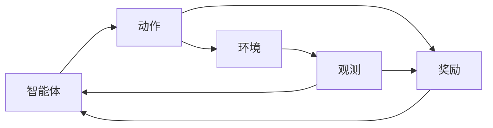

#深度学习 #机器学习 

# 机器学习和人工维护系统的区别
[[d2l-zh-pytorch-anno#^8mmthhgo6g6|机器学习（machine learning，ML）是一类强大的可以从经验中学习的技术。]]
[[d2l-zh-pytorch-anno#^zk1u612r1j|对于刚刚所说的电子商务平台，如果它一直执行相同的业务逻辑，无论积累多少经验，都不会自动提高，除非开发人员认识到问题并更新软件]]

采用机器学习的程序/系统可以根据经验更新，而不需要等到检测到问题时更新；而人工维护的程序/系统往往需要等到产生较大问题时开发人员才根据已经积压的经验对其进行更新。

# 机器学习的唤醒词案例
[[d2l-zh-pytorch-anno#^vex58txozkn|数据编程（programming with data）]]
音频作为输入，识别输入音频是否对应于唤醒词，然后将“是/否”字符作为输出，这样一个程序称为模型。
模型的输出由许多参数决定，调整参数得到不同的模型去识别不同的唤醒词，这些模型的集合称为模型族。
通过数据集来生成参数的程序称为学习算法，机器学习中的学习也就是通过数据集得到合适的参数集的过程，或者称之为训练模型。

# 机器学习的关键组件
## 数据

预测得到特殊的属性label/target。

[[d2l-zh-pytorch-anno#^ee8gvuxg0ua|与传统机器学习方法相比，深度学习的一个主要优势是可以处理不同⻓度的数据]]

固定长度：标准图像；
非固定长度：互联网图像、评论区文本。

[[d2l-zh-pytorch-anno#^rzi780etuw|更多的数据可以被用来训练出更强大的模型，从而减少对预先设想假设的依赖。数据集的由小变大为现代深度学习的成功奠定基础]]

想要训练合适的参数集，需要数据：
- 大量
- 正确

## 模型
[[d2l-zh-pytorch-anno#^wfhuht81ub|深度学习与经典方法的区别主要在于：前者关注的功能强大的模型，这些模型由神经网络错综复杂的交织在一起，包含层层数据转换，因此被称为深度学习（deep learning）]]

## 目标函数

[[d2l-zh-pytorch-anno#^yi7j2b4xj8h|我们通常定义一个目标函数，并希望优化它到最低点。因为越低越好，所以这些函数有时被称为损失函数（loss function，或cost function）]]

目标函数量化了模型解决问题的效能，便于测量模型学习的结果优劣。

目标函数样例：
- 预测数值时，使用平方误差作目标函数
- 解决分类问题时，使用最小化错误率（预测与实际情况不符合的比率）作目标函数

[[d2l-zh-pytorch-anno#^d1qfhh8uies|有些目标函数（如平方误差）很容易被优化，有些目标（如错误率）由于不可微性或其他复杂性难以直接优化。在这些情况下，通常会优化替代目标]]

[[d2l-zh-pytorch-anno#^f9vf1r4kmpr|通常，损失函数是根据模型参数定义的，并取决于数据集。在一个数据集上，我们可以通过最小化总损失来学习模型参数的最佳值。]]

[[LEC01-深度学习入门#数据集的分类]]
[[LEC01-深度学习入门#泛化]]

## 优化算法

优化算法用于搜索出最佳参数以最小化损失函数。
深度学习中，优化算法通常使用梯度下降法。
梯度下降法，即检查每个参数，看看如果仅对该参数进行少量变动，损失函数会如何随之变化，然后其可以在减小损失函数的方向上对参数进行优化。

# 各种机器学习问题

## 监督学习
[[d2l-zh-pytorch-anno#^7ljxezhxk1|在给定一组特定的可用数据的情况下，估计未知事物的概率]]

监督学习的训练集中的样本都有**真实确定的标签**。
监督学习的模型可以对于一组特征预测出其标签。
[[d2l-zh-pytorch-anno#^tuu78dzp9a|举一个具体的例子：假设我们需要预测患者的心脏病是否会发作，那么观察结果“心脏病发作”或“心脏病没有发作”将是样本的标签。输入特征可能是生命体征，如心率、舒张压和收缩压等]]

![[Pasted image 20230506130018.png]]
监督学习通常的三个步骤：
1. 获取带真实标签的样本集作为训练数据集
2. 选择合适的有监督的学习算法，将训练数据集作为输入，得到“已完成学习的模型”作为输出
3. 将未作为训练集的样本的特征作为“已完成学习的模型”的输入，使用模型的输出作为相应测试样本的标签预测。

### 回归Regression

回归问题的特点：模型的输出是一个数值。

- 估计房子的平均市场价格
- 预估用户对电影的评分

### 分类
[[d2l-zh-pytorch-anno#^yrv5lidtz2|回归是训练一个回归函数来输出一个数值；分类是训练一个分类器来输出预测的类别。]]

分类的过程：样本作为模型输入，得到一个对应于各个类别标签的概率序列作为输出。

分类有几种：
- 二项分类
- 多项分类
- 层次分类

### 标记问题
[[d2l-zh-pytorch-anno#^e5bq48kq5n7|学习预测不相互排斥的类别的问题称为多标签分类（multi-label classification）。举个例子，人们在技术博客上贴的标签，比如“机器学习”“技术”“小工具”“编程语言”“Linux”“云计算”“AWS”。一篇典型的文章可能会用5〜10个标签，因为这些概念是相互关联的。]]

多标签分类问题的特点：输出中可能包含多个标签。

[[如何解决笔记系统中的分类问题？]]
这里我们可以看出，打标签实际上耗时而且依然是一种设计，分类和标签应该是随着知识和经验的体量增大后自然出现的结果，而不是事先设计的结果。
打了标签的文章在一段时间后一定会隶属于新的标签下，如果实时维护实际上是不现实的，比如每写一篇文章就遍历一遍所有先前的文章，更新所有文章的标签项。

### 搜索

查询搜索引擎，得到许多网页作为输出，这些网页会有自己的相关性，搜索引擎根据相关性来对网页进行排序，作为真正的展示页面。

[[d2l-zh-pytorch-anno#^o0cpt5zblj|如今，搜索引擎使用机器学习和用戶行为模型来获取网⻚相关性得分]]

### 推荐系统
[[d2l-zh-pytorch-anno#^7h37rrm8xpu|另一类与搜索和排名相关的问题是推荐系统（recommender system），它的目标是向特定用戶进行“个性化”推荐。]]

- 电商平台的商品推荐
- 音乐播放软件的音乐推荐

[[d2l-zh-pytorch-anno#^82lzivnyrpc|关于如何处理审查、激励和反馈循环的许多问题，都是重要的开放性研究问题。]]
模型和人的交流需要考虑在优化算法内。

### 序列学习

[[d2l-zh-pytorch-anno#^b6rtcptbmya|序列学习需要摄取输入序列或预测输出序列，或两者兼而有之。]]

序列比如视频片段。

自动语音识别：输入序列是说话人的录音，输出序列是对说话人说话内容的文本记录。

## 无监督学习
[[d2l-zh-pytorch-anno#^hb0jinpbj57|数据中不含有“目标”的机器学习问题通常被为无监督学习（unsupervised learning）]]

- 聚类（clustering）问题——无标签样本自动分类
	- 为照片分类
	- 为用户分类
- 主成分分析（principal component analysis）问题——找到少量的参数准确地捕捉数据的线性相关属性
	- 用球的速度、直径、质量描述球的运动轨迹
- 因果关系
- 生成对抗性网络

## 与环境互动

离线学习：所有的学习都是在算法与环境断开后进行的。

## 强化学习

深度强化学习的案例：
- 深度Q网络——雅利达游戏中仅使用视觉输入就击败了人类
- AlphaGO程序——围棋中击败世界冠军

强化学习和环境之间的相互作用：

[[d2l-zh-pytorch-anno#^pe7fhaiha|图1.3.7: 强化学习和环境之间的相互作用]]

强化学习的目的：产生较优的策略供动作与环境进行交互，策略policy即一个从环境观察映射到行动的功能。

# 起源

[[d2l-zh-pytorch-anno#^yg3jh4yjqj|人类⻓期以来就有分析数据和预测未来结果的愿望，而自然科学大部分都植根于此。]]

机器学习兴起的原因
- 统计数据的收集和可获得性
- 克劳德·香农的信息论和艾伦图灵的计算理论
- 神经科学和心理学——比如：赫布学习

neural networks命名的核心：
- 层layers
- 链式规则/反向传播（backpropagation）
[[d2l-zh-pytorch-anno#^z7l4ta1g8n|考虑到数据和计算的稀缺性，核方法（kernel method）、决策树（decision tree）和图模型（graph models）等强大的统计工具（在经验上）证明是更为优越的。与神经网络不同的是，这些算法不需要数周的训练，而且有很强的理论依据，可以提供可预测的结果]]

# 深度学习的发展

[[d2l-zh-pytorch-anno#^ilrcbc6tnvk|随机存取存储器没有跟上数据增⻓的步伐]]

#学习断点

# 深度学习的成功案例
# 机器学习和深度学习的特点
# 小结
[[d2l-zh-pytorch-anno#^lidvx6vpew|表示学习作为机器学习的一类，其研究的重点是如何自动找到合适的数据表示方式。深度学习是通过学习多层次的转换来进行的多层次的表示学习。]]