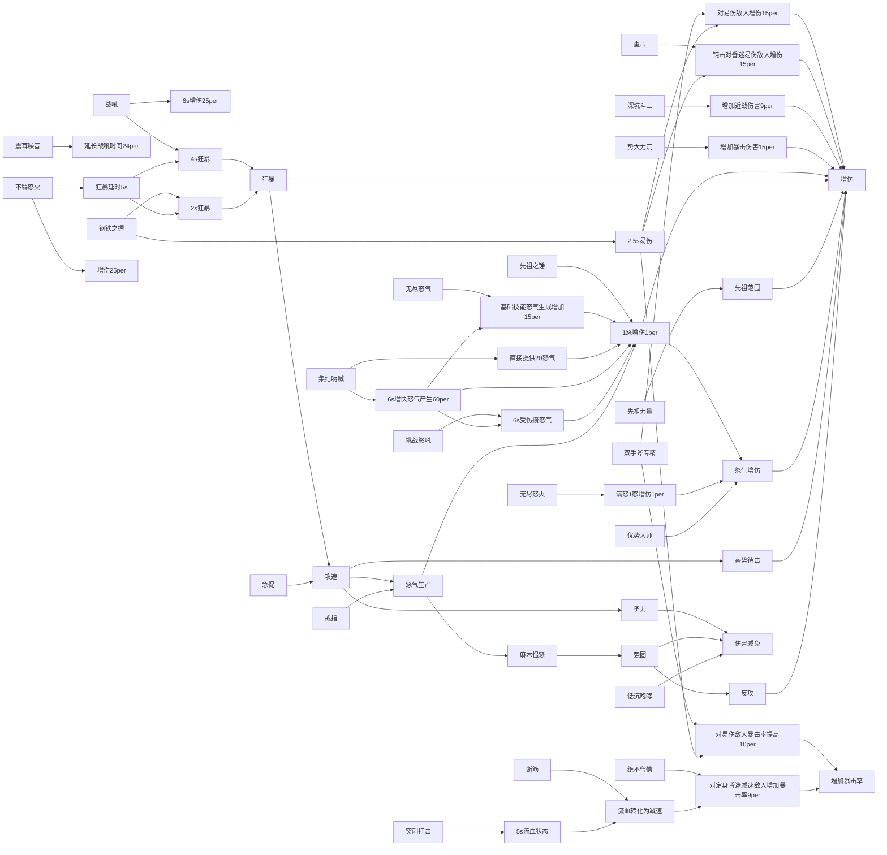

build简介:
此build核心技能为先祖之锤,输出核心属性为流血|减速|易伤|怒气转化伤害|狂暴.
build面向拥有49技能点的野蛮人,前期开荒可以参考Rob的撕裂(痛割)流.
本build仅对技能点|保底威能有要求,都是花时间可以得到的,对于词条|非保底威能没有硬性要求,但是词条最好是选择和输出核心属性相近的.
非保底威能最关键的是酋长之怒,减少战吼技能冷却时间.

build构建算法:
本build采用贪心算法来构建,即逐步优化和反证法.
具体来说,如果将压制特性加入build的同时,压制带来的收益不能弥补削减其他特性产生的空缺,那么就不需要加入压制特性.如果可以带来提高,就加入压制特性.以此类推,可以加入其他的未考虑的可能带来提升的特性(比如眩晕|压制|幸运一击|强固).

build构建思路:
本build构建流程是专精-->技能-->威能.
本build已经完成的场景是纯粹攻击-->攻防一体.

单体和刷图的两键切换:
关键被动是狂怒增强(不羁怒火)还是核心增强(怒不可遏)看各位看官面对什么场景,如果是打单体爆发选择核心增强,如果是刷图点狂怒增强(因为怒不可遏2倍怒气).

build拓展:
接下来build还需要完善的是怒气补充能力,但是可能要用到非保底威能和雕纹,不过本build实测通关难度二的圣殿大教堂绰绰有余,之后的路各位萌新看官也一定能做出自己的选择.
本build参考了rob最新的hotA build和咖啡猫|琉璃的一些思路,推荐大家去youtube和bilibili关注他们.

build求助:
build的构建不是一蹴而就的,需要慢慢优化,有值得改进的地方欢迎评论区指出来.
比如:
钢铁之握的易伤和揭示弱点的易伤是覆盖关系还是叠加关系.
钢铁之握的狂暴和战吼的狂暴是覆盖关系还是叠加关系.
相同的攻击威能能否叠加