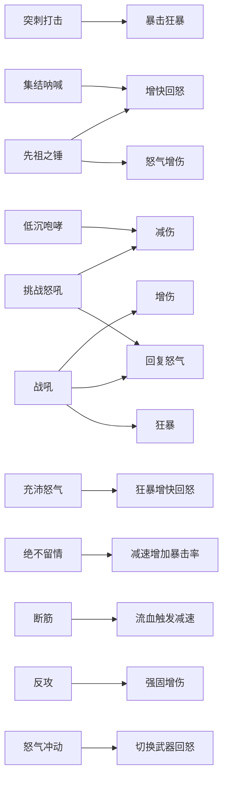
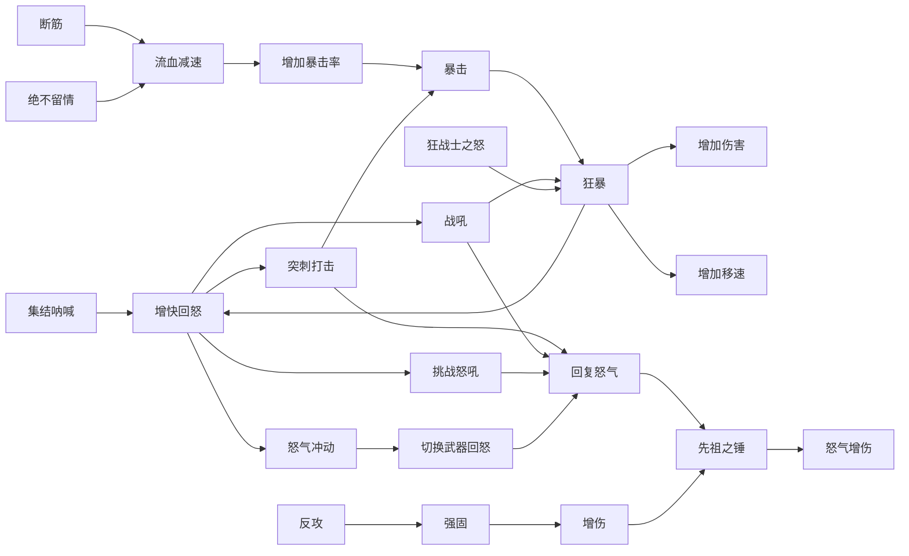

体验了旋风斩build后发现其最大问题在于墨迹，和易伤的非常驻。

84级的野蛮人和73级的不同，已经具有了暴击以及狂暴常驻的可能性。

主要回怒手段有狂暴增速、战吼增速、戒指两件套、切换武器回怒。

对于威能和暗金装备的要求降低，提高了威能的发挥空间。

另外，根据最新评测，鬼迷心窍的护盾不能够触发骄狂威能，而且无尽怒火实测中是常驻拉满的，故而将骄狂威能取下。

强固从巅峰盘获取。

# 技能搭配
技能效果图

技能联动图

- 从技能联动图中得知:
1. 集结呐喊和增快回怒非常关键,需要在其他机制中继续增加资源(怒气)生成速度
2. 流血状态的触发需要其他机制补充(装备 威能 巅峰盘)
3. 暴击使得狂暴常驻,需要其他机制增加暴击率
4. 本套技能基本用法:先开集结呐喊,再开另外两吼,获得怒气常驻,然后平A和先祖之锤交替使用,等战吼技能好了继续开.
5. 本技能中提供了切换武器这样一种常驻新机制,需要考虑切换武器在其他机制中带来的变化.
6. 强固可以带来受伤减免和伤害增加,需要在其他机制中补充强固生成.

需要其他机制补充总结:暴击率|流血触发 > 资源生成速度|怒气回复 > 强固

# 威能
武器专精选择双手剑,提供流血,这是唯一先祖锤build触发流血的方式.(除非威能解禁)

巅峰盘能够提供暴击率和强固,而威能只能提供强固,所以选择由巅峰盘提供暴击率,威能提供强固.

**头盔**选择**麻木**.
先祖锤放劈砍，然后敲外圈（a一下然后反方向敲击）吃到双倍伤害