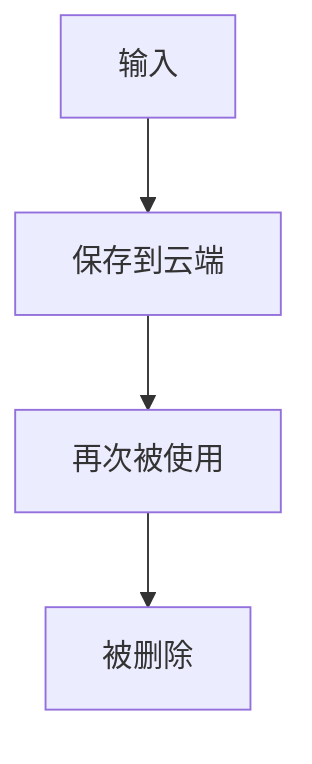
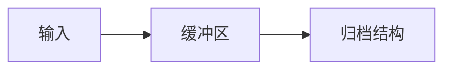

书签是一种记录文件，记录文件的生命周期主要是：

==输入==

书签的输入一般具有突发性，即输入往往都是发生在浏览某个网页的随机时刻。
比如看知乎的时候突然感觉某个经验贴很有帮助决定收藏一下。
但是在保存网页到书签的结构当中的时候很可能由于分类操作而打断原先的思考进程。
所以需要为输入和归档结构之间建立一个缓冲区

==缓冲区==
缓冲区需要放在最便于再次浏览和随时及时存储的地方。

==归档结构==
归档结构往往也需要分层。

- 我现在正在做的事情
- 以及收纳整理区，可能很长时间都不会再触碰的区域

我放入收藏夹的内容都是之后可能用到的，或者需要之后仔细研究的，技术性的问题的解决文章没有必要放入其中，问题解决类的文章可以集成在实验文档的参考文献当中。

==有关整理==
每段时间的学习之后不仅需要整理自己的笔记，还需要整理自己浏览过的文献和博客，不然就等于看了没有看

==有关分类==
某一个条目下有超过十条内容就进行分类