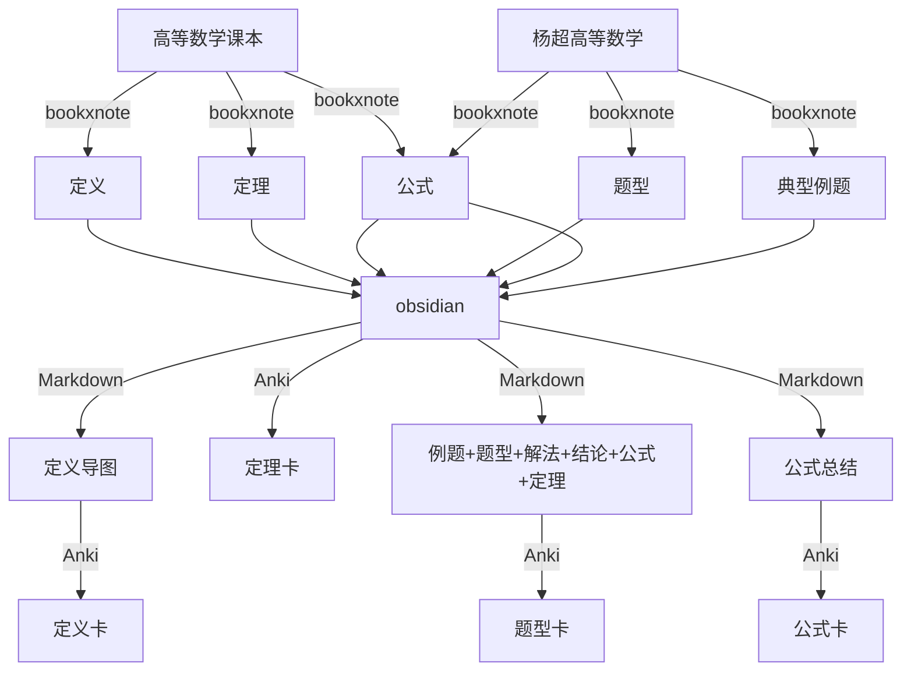

```toc
```
# 数学学习流
优先级：刷题>题型总结>书本总结
公式总结时间很随机，遇到就总结起来

## 学习流设计
当前目的:最短时间拿最高分
1. 计算--每天背公式--公式Anki卡
2. 定义定理体系构建--每天两课
	1. 定义作为骨干框架画图--图形Anki卡
		1. 分类式定义
		2. 开拓式定义
	2. 定理有两个角度的研究方法:
		1. 定理作为研究对象, 一般对于重要定理使用该方法研究
			- 定理名称作为卡片正面
			- 卡片背面
				1. 定理的前置定义或定理
				2. 定理成立的前提条件
					1. 破坏前提条件时的处理方法
					2. 前提条件的变形
				3. 定理的内容
					1. 定理的证明或理解思路
					2. 一般实例模拟
					3. 特殊情况讨论
				5. 定理的扩展与延伸
					1. 具象化——常用实例
					2. 抽象化——二级结论
		2. 题型作为研究对象:
			1. 正面: 题型名称+例题
			2. 反面:
				1. 所用定理及解题思路
				2. 例题解答
				3. 二级结论
3. 二级结论积累
	1. 每天晚上总结白天遇到的习题中的二级结论将二级结论归类到对应的题型当中去


## 学习流导图


## 题型总结方法
1. 切入点一: 题型识别(题型种类概览, 相互转化的导图, 每种题型的解决方法)
2. 切入点二: 方法分类(方法介绍, 方法适用范围)
3. 切入点三: 常用公式结论总结
4. 切入点四: 典型例题

题型和方法两个集合是多对多的映射关系, 单从哪个方向看都不全面


