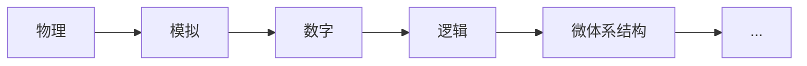

# 待办
- 倒计时: 9月末--70天

- [x] 早上7点起床
	- [x] 扇贝英语单词半小时+吃早饭
	- [x] 数学公式Anki半小时

- [ ] 8点
	- [ ] 高数教科书定义定理整理(Bookxnote-->Obsidian-->Anki)每天两节,一小时
		- [ ] 每个单元完成后整理一次定义
		- [ ] 每个小节完成后整理一次定理
	- [ ] 题型整理
		- [x] 刷两课超详解,三小时
		- [x] 整理题型+公式,半小时

- [x] 下午2点起床 , 每天按照如下AB计划顺序交替进行:
- [x] A计划
	- [x] 数据结构两小时

- [ ] 晚上七点起床
	- [x] 英语半个小时阅读
	- [ ] 英语半个小时长难句
	- [ ] 半个小时长难句例句Anki+阅读生词Anki 复习和整理
	- [ ] 洗澡打电话半个小时 随机时间
	- [ ] 学习工具,完善体系,复盘整理
	- [ ] 剩余时间看线性代数和徐涛强化班
	- [ ] 十一点睡觉

# 笔记
## 定义
## 定理
在$0*\infty$类型中的0依然可以使用等价无穷小公式的变形，直接将g代换成g1
证明：
1. 0*$\infty$=$\frac 0 0$
2. f/g = f/g1 * g1/g, 假设法分裂求解，g1/g = 1, 故而只需要对于g1/进行求解


对于fg型泰勒展开
1. 明确展开k阶
2. 找出f的最低阶m1，g的最低阶n1
3. g需要展开到m1+ n2 = k 的 n2 阶，f需要展开到n1 + m2 = k 的m2阶
4. 对f的每一项fi进行扫描，将fi与g中的每一项gj再进行扫描，找出i和j的阶数相加后的值满足<=k 的 乘积，提取到对应的乘积结果项数的系数中去


对于f/g的情况
1. 如果f和g都是具体函数, 则要求f和g都在n阶导数存在（可求），然后对于f/g的f'/g'进行试探法求解
2. 如果f和g都是抽象函数，则当f和g都在n阶导数存在时，lim f'/g' 的值依然未知，如果加上条件fg连续，则lim f'/g' = f'(x0)/g'(x0)


如果函数f具有斜渐近线，则f是x的同阶无穷大，且剩余部分趋于极限时是常数


对于放缩法来说需要放缩的是无穷大的非 线性主部部分

绝对值要么分段处理，要么放缩处理


## 题型
## 公式
## 数据结构
考试中的注释必不可少，重要的是让老师理解我们的思路
1. 变量定义处告知变量的用途
2. 伪代码和函数调用处告知该部分实现功能
3. 代码逻辑复杂处告知程序含义

什么是不可以省略的？
某个部分的代码占整体代码的1/4则说明该部分代码比较重要，故而需要详细写出，不能省略

可以简写：
- 最大最小值Max_int、Min_int 
	（Max_float，Min_float）
- 比大小函数 max(a, b) min(a, b)
- 输入输出函数 Cin、Cout，不用管变量的类型，会简洁很多
	- Cin>>A[0]>>b>>c
	- `Cout<<b<<c`
- `A[i++]`先输出Ai再自增，`A[++i]`先自增再输出Ai
- 交换函数swap(a,b)


复杂度问题：
- 题目的描述
	- 时间上尽可能高效——不用管空间
	- 时间和空间两方面都尽可能高效——先时间后空间
	- 尽可能高效——先时间后空间
	- 空间复杂度位O(1)且时间上尽可能高效的算法
	- 对于复杂度无明确要求——能做出来就可以，且为满分
		- 对于树的算法非递归算法复习优先级较低
- $O(f(n))$复杂度定义
$$\lim_{n\to \infty}\frac{T}{f(n)} = K (K为常数)$$
- 考虑复杂度时涉及对数写成$\log x$


时间复杂度只需要考虑循环与递归次数
- 循环
	- 尽量写for循环，便于分析时间复杂度
- 递归
	- 递归总次数和时间复杂度有关，而最大递归层数和空间复杂度有关
	- 比如树的节点树是递归遍历树的次数，树的高度是递归遍历树的层数

大题只计算最坏复杂度，平均复杂度难以计算

先写出暴力解法：
- 枚举法
	- 把所有可能的情况都处理一遍，然后从中选出符合题目要求的情况，通常使用for循环遍历
- 对无序数组排序

如何优化？
- 有没有条件没用到
- 有没有超额完成任务
- 有没有别的思路

潜在优化算法：
- 折半查找——条件：一个、数组、有序——用到了随机存取
	- 题目中出现有序数组的时候，首先想到是否需要查找，能不能使用折半查找
	- 对于折半查找，查看只有两个元素的时候是否会出现死循环
```C
int Binary_Search(int A[], int L, int R, int x){
	int mid;

	while(L <= R){
		mid = (L+R)/2;

		if(A[mid] < x)
			L = mid + 1;
		else if(A[mid] > x)
			R = mid -1;
		else
			return mid;
	}

	return -1; // 表示查找失败
}
```
- 数组指针后移——可以用于合并多个有序线性表，查找第k个元素，归并排序也使用了这种思想
	- 条件：多个、线性表、有序——没有用到随机存取，链表也适用该方法
- 简单动态规划——以空间换时间
- 贪心思想——每次选最有利的

快排如何使用？


## 阅读

今天的阅读做法：
1. 浏览题干， 找出关键词，了解本文核心讨论的主题
2. 边读文章边做题，一段一题，（定位题干关键词）
3. 例证题，直接看例证之前的告知目的的话语

## 长难句例句分析

# 数字逻辑
1. 控制抽象性的艺术
	1. 抽象
	2. 约束
	3. 3Y
		1. 分层化（Hierarchy）
		2. 模块化（Modularity）
		3. 规整化（regularity）
2. 分层结构：


3. 模拟-->数字
	
	

4. 数字-->逻辑
	1. 数字信号离散值-->数制
	2. 门电路-->布尔代数
	3. 逻辑功能-->真值表/状态转换图-->布尔表达式

5. 组合逻辑电路
	1. 设计方法: 实际问题分析-->输入输出-->真值表-->布尔表达式-->卡诺图-->化简后的布尔表达式-->电路原理图
		
	1. 三个重要器件: 
		- 三态门
			- 
		- 复用器
			- 
		- 译码器
			- 
	2. 最大时延(关键路径)与最小时延(最短路径)
		
		
	4. 毛刺
		1. 简单的产生原因: 卡诺图相切, 通过增加冗余项解决
		2. 实际情况下的毛刺不可避免, 需要认识即可

6. 时序逻辑电路:
	1. 同步时序逻辑电路 = 组合电路 + 寄存器 + 同步时钟控制
	2. 时序元件:
		1. 交叉耦合双反相器
		2. SR锁存器
		3. D锁存器
		4. D触发器
			由两个D锁存器构成, 分别使用CLK和CLK'控制
			当CLK'来临时, 主锁存器透明, 从锁存器阻塞
			当CLK来临时, 主锁存器阻塞, 从锁存器透明
			上升沿时, 完成由主至从的数据传输
		5. 寄存器
			由同一个时钟信号控制的D触发器组
		6. 使能端(功能层面控制, 比统一时钟控制更高层)
		7. 复位端(同步异步两种)
	3. 同步时序逻辑电路设计方法:
		1. 分析具体问题得出输入输出
		2. 画状态转换图
		3. 对于Moore型状态机
			写出状态转换表(现态, 输入, 次态)
			写出输出表(现态, 输出)
		4. 对于Mealy型状机
			写出组合的状态转换表(现态, 输入, 次态, 输出)
		5. 状态编码
		6. 写出次态和输出布尔表达式
			1. 现态+输入-->次态
			2. 现态(+输入)-->输出
		7. 画出原理图
			
	4. 时序约束
		1. 最大组合约束
			
			
			
		2. 最小组合约束
			
			
			

			
			


## 任务节点
- [ ] 高等数学超详解前三单元刷完+总结——5号之前
- [ ] 高等数学强化超详解完成 ——6号-20号（每天10面纸新课，10面纸旧课）
	- [ ] 第四单元
	- [ ] 第五单元
	- [ ] 第六单元
	- [ ] 第七单元
	- [ ] 第九单元

- [ ] 线性代数20-30号

- [ ] 数据结构第二轮——7号
- [ ] 计算机组成原理——15号
- [ ] 计算机网络——23号
- [ ] 操作系统原理——30号