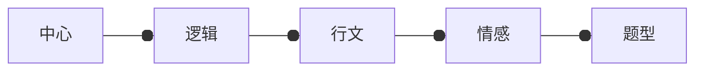

```toc
```
# 任务
- [x] 完成反常积分判敛及计算的整理
- [x] 完成880积分学两面纸题目
- [ ] 完成数学公式积分学的整理和背诵
- [x] 完成李永乐线性代数第三讲整理
- [x] 完成李永乐线性代数第四节课
- [x] 单词背诵
- [x] 2010text2 完成并听解析
- [x] 数据结构第二讲课程
- [ ] 完成计算机组成原理和数据结构第一讲整理

# 笔记
## 英语阅读


整体思路：找**中心**，中心就是答案

解题顺序：先题（**题干逻辑**）后文

读文章（**行文原则**）
	**文章逻辑**有句内（**情感**），句间，段间


# 疑问

# 新增处理事项
- [ ] 8.4,8.5，8.6整理 
- [ ] 数字逻辑Anki整理——8-1

- [ ] 准备简历
- [ ] 幕布笔记迁移
- [ ] 过往博客迁移
- [ ] 硬盘U盘整理


