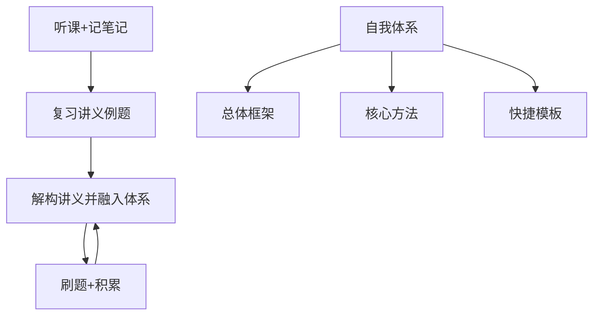

## 总体认识方法——辩证法
- 对立统一——联系的总体结构
- 量变质变——发展过程
- 否定之否定——发展过程
## 总体学习方法

==学习方法==
1. 微观上——连接
2. 宏观上——场景
3. 时间上——反复

==整体流程==

- 所有的总体框架都是由前辈的经验搭建，在之后的刷题实践中，我来对其进行修改。

## 休息时刻

==休息的时候==
- 5分钟的可以听歌冥想
-  15分钟的可以听歌休憩
-  中午12：30-13：00，晚上18：30-19：00可以
	- 做计划
	- 整理日记、周记、月记
	- 整理Chrome账号库
	- 整理各种社交平台账号
	- 整理QQ社交帐号

==各种账号==
- Bilibili
- 知乎

## 学习内容载体与形式

==载体==
- 纸质书
- Bookxnote
- Obsidian
- 百度网盘

==形式==
- 视频——只看一遍
- 讲义——遗忘时浏览
- 导图——每日一遍

==高等数学==
1. Bookxnote导图
2. 云记手写板浓缩方法笔记
3. Obsidian 题型-方法 系统

==信息收集载体==
- Bilibili  UP主
- 考研群（QQ）