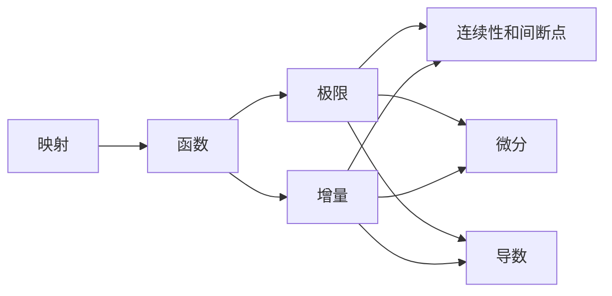

# 待办
- 倒计时: 9月末--70天

- [ ] 早上7点起床
	- [x] 扇贝英语单词半小时+吃早饭
	- [x] 数学公式Anki半小时

- [ ] 8点
	- [x] 高数教科书定义定理整理(Bookxnote-->Obsidian-->Anki)每天两节,一小时
		- [ ] 每个单元完成后整理一次定义
		- [ ] 每个小节完成后整理一次定理
- [ ] 题型整理
	- [ ] 刷两课超详解,一小时
	- [ ] 整理题型+公式,15分钟
	- [ ] 刷两课A组139,一小时
	- [ ] 再整理15分钟

- [x] 下午2点起床 , 每天按照如下AB计划顺序交替进行:
- [ ] A计划
	- [x] 数据结构两小时
	- [ ] 计算机操作系统一个半小时
- [ ] B计划
	- [ ] 计算机组成两小时
	- [ ] 计算机网络一个小时
	- [ ] 整理一个AB循环的Anki闪卡,半小时

- [x] 晚上七点起床
	- [x] 英语半个小时阅读
	- [ ] 英语半个小时长难句
	- [ ] 半个小时长难句例句Anki+阅读生词Anki 复习和整理
	- [ ] 洗澡打电话半个小时 随机时间
	- [ ] 学习工具,完善体系,复盘整理
	- [ ] 剩余时间看线性代数和徐涛强化班
	- [ ] 十一点睡觉

# 笔记
## 定义
## 定理
## 题型
## 公式
## 数据结构
数据结构一共45分
- 小题11个，每个2分，共22分
- 大题2个，共23分，具体每题分值不固定

### 大题如何备考？
综合应用题（大题)分为两道：
- 算法题
	- 三部分
		- 描述算法思想（8min）
		- 手写代码（10min）
		- 分析复杂度（2min）
	- 判分标准
		- 对于分析复杂度来说，只要对于自己选择的算法分析正确，就可以给该部分全分
		- 对于前两部分来说，选择的算法的时间复杂度的优劣决定了该部分的得分情况，最优解和次优解相差1到2分
	- 解题策略
		- 尽量将解法划归到已经掌握的算法中的最优解，而不要在考场生扳硬造
		- 稳定优解的分析复杂度也是固定的步骤，便于节省时间和提高得分率，最优解的时间复杂度可能是全新的分析过程，容易出错
		- 没有说明或者禁止的算法操作都可以使用
	- 备考策略
		- 按照高频考点和”XX的应用“章节的并集进行复习
		- 复习具有高区分度（有多种时间复杂度）和20分钟以内可以解决的算法的代码（尤其是线性表的应用）

- 应用题
	- 往往是要求画图模拟算法过程或者要求写出数据结构定义
	- 备考策略
		- 复习”XX的应用“当中的算法

### 我该如何备考？
现在我需要按照高频考点和应用章节的并集进行复习
1. 看模拟实例，如果不清晰，看视频回放
2. 总结对应模拟过程或者代码
3. 制成Anki卡片

在准备完大题之后，回过头刷小题知识点，按照题目--题解+知识点的形式准备Anki卡片

## 操作系统
## 计算机组成
### 《数字设计与计算机体系结构》第一章有感
- 控制复杂性的艺术
	- 抽象——分册你
	- 约束——模块化
	- 规整化
- 对于数字系统来说：物理-->晶体管-->模拟电路-->数字电路-->逻辑设计-->微体系结构-->体系结构-->操作系统-->应用程序

- 模拟电路到数字电路，通过模拟量到离散量的映射，包括噪声冗余的设计
- 从数字电路到逻辑设计需要逻辑门和布尔代数的对应转换

### 第二章
组合电路基本原理：
1. 一个或多个输入
2. 一个或多个输出
3. 功能规范
4. 时序规范

组合电路构成：
- 由相互连接的元件构成
- 元件本身也是组合电路
- 一个电路节点或者是一个电路的输入，或者是连接到外部电路的一个输出端
- 电路不包含回路

组合电路的输出完全由输入决定，无记忆。
时序电路的输出由当前状态和输入共同决定，有记忆。

## 计算机网络
## 阅读生词
## 长难句例句分析

今夜难以入眠，可能是单纯的失眠，也有可能是命运在提醒我好好反思一下考研的计划。

# 研究各路大佬考研经验
## [404分大佬](https://www.bilibili.com/read/cv15453344)
- 数学经验
	- 重视基础
		- 明晰定义之间的脉络与联系
		- 理解定理的来源、前提、使用方法、扩展场景、实例
	- 质大于量
		- 高等数学杨超全家桶反复刷（强化教材和139习题库）
		- 线性代数杨超强化教材+李永乐强化教材
		- 10月份开始概统、真题卷和模拟卷
	- 重视计算
		- 每天背诵公式—— #Anki待整理清单

- 408经验
	- 重视真题
	- 反复多次—— #Anki待整理清单 
	- 8月份跟着王道强化课程过教材
	- 9月份每周过一遍王道书+整理Anki知识点
	- 10月份开始真题+黑书+Anki复习王道知识点

- 英语经验
	- 每天都要背单词
	- 8月份开始刷阅读+长难句书本
	- 9月份开始准备其他题型

- 政治经验
	- 8月份徐涛马原听完
	- 9月份1000题刷完

## [428分大佬](https://www.zhihu.com/question/509690780/answer/2408249539)
- 408——真题很重要且有规律
- 英语——多刷真题，两遍以上
- 政治——肖秀荣1000题，肖4肖8

### 教材推荐
**《深入理解计算机系统》**
- 简称csapp，配套的lab跟着做了好几个，算是我的计算机入门书，这本书对计组、OS乃至编译原理和网络编程都有所涉及，其中对考研帮助最大的应该是**机器数部分**，清晰易懂，与国内教材区别甚大。除了后面三章都看完了。

计网的[自顶向下](https://www.zhihu.com/search?q=%E8%87%AA%E9%A1%B6%E5%90%91%E4%B8%8B&search_source=Entity&hybrid_search_source=Entity&hybrid_search_extra=%7B%22sourceType%22%3A%22answer%22%2C%22sourceId%22%3A2408249539%7D)
- 也很不错，除了后面的网络安全和多媒体部分都看完了，书中会有一些例子和讲解非常好，但有些考研喜欢考的细节自顶向下中没有详细讲，王道的计网里应该会有

- 《操作系统概念》电子版
感觉要比图中的这本更容易理解，另外还有一本黑书叫现代操作系统，感觉都可以当字典用，学不明白的知识点找相关章节看看

- PAT和数据结构代码题推荐《算法笔记》，配着PAT题库一起刷

### 关于考研各科目要不要看视频/网课
- 数学不建议把听网课当作主要复习手段，效率低，不如看书做题知识密度高
- 408网课个人不推荐，建议看书，不懂的知识点查书或者google+英文搜，事半功倍
- 英语不推荐看网课，少听废话多积累
- 政治，可以当作休闲视频看，我看不太懂政治那些知识，所以听了徐涛马原部分的课，有助理解，思修毛概史纲部分没看，感觉看书就行

### 数学
- 高数
	- 理解与反思
	- 几何和代数两个角度理解
	- 高级结论是可以记一记的，但要记准，同时也不要陷入思维定式
	- 客观题解题技巧还是很有用的，考场上万一选择题有不会的，[代特殊值法](https://www.zhihu.com/search?q=%E4%BB%A3%E7%89%B9%E6%AE%8A%E5%80%BC%E6%B3%95&search_source=Entity&hybrid_search_source=Entity&hybrid_search_extra=%7B%22sourceType%22%3A%22answer%22%2C%22sourceId%22%3A2408249539%7D)、排除法等都可以试试，但平时学习还是要弄清楚学明白。
	- 总结细节
- 线代
	- 3b1b视频
	- 线代会有一些定理和推论，在同济教材和李永乐书上都是有证明，建议学到跟着证一证
- 概率论
	- 概率论大部分题目都比较基础或者说是死板，理解并记清楚基本的概念就行，还有要注意的就是计算。算一些概率题时可能会用到 Γ 函数，可以简化运算。

### 408
- 学408不仅要对知识点理解透彻，审题时也要把题目问什么和可能挖的坑弄清楚
- 数据结构-->计算机组成-->操作系统-->计算机网络
- 数据结构:
	- C/C++
	- DS和其他3个科目的区别在于注重对各种数据结构特性和各类算法的操作过程的理解，记忆量并不太大。
	- 学到哪个数据结构或算法对就照着书**写一些代码实现**它，这样DS的学习过程要有趣一些，也更好理解。
	- 前些年408会考一些较难的算法题，所以我挺建议尽早学完数据结构然后抽碎片时间在pat或是[leetcode](https://www.zhihu.com/search?q=leetcode&search_source=Entity&hybrid_search_source=Entity&hybrid_search_extra=%7B%22sourceType%22%3A%22answer%22%2C%22sourceId%22%3A2408249539%7D)上刷些算法题，就算是提前为机试做准备，也是为了408算法题积累思路。
- 计算机网络
	- 《自顶向下》[数据链路层](https://www.zhihu.com/search?q=%E6%95%B0%E6%8D%AE%E9%93%BE%E8%B7%AF%E5%B1%82&search_source=Entity&hybrid_search_source=Entity&hybrid_search_extra=%7B%22sourceType%22%3A%22answer%22%2C%22sourceId%22%3A2408249539%7D)的最后几页有个web request过程大杂烩，从插网线后DHCP获得ip地址一层一层讲到http报文送到浏览器，强烈推荐。
	- 计网大多数部分需要记忆，各个协议的用途和数据包中各种头部的信息含义都有很多的细节，我的立场一直是理解的基础上记忆，协议栈中很多技术细节都有其用意
	- 408计网选择题出题有些诡异，会出一些比较偏的点。建议注意一些冷门考点，复习全面，对于后面可能有的考点，我猜一波BGP和移动ip，《自顶向下》5.4节开头有一句我影响深刻：“BGP is arguably the most important of all the Internet protocols (the only other contender would be the IP protocol)” 说明BGP明明在网络中很重要，但408一直没考它的细节，我不太理解... 还有[移动ip](https://www.zhihu.com/search?q=%E7%A7%BB%E5%8A%A8ip&search_source=Entity&hybrid_search_source=Entity&hybrid_search_extra=%7B%22sourceType%22%3A%22answer%22%2C%22sourceId%22%3A2408249539%7D)也是很值得考的点，不太懂为什么不考...

# 学习流完善
1. 任务规划
2. 每日学习-->学习记录在每日笔记和Bookxnote中
3. 重构知识，生长系统
	1. 
4. 导出卡片，Anki记忆

# Anki卡片形式
- 对于某一门学科来说：
	- 思维导图型卡片
	- 填空型
- 对于概念性知识：
	- 正面名词
	- 反面解释
- 对于分析性知识：
	- 正面例题
	- 反面解答、相关定理和算法
- 对于基础规则：
	- 默写卡
	- 例题卡

# Mermaid流程图
[参考教程](https://segmentfault.com/a/1190000041781220)

## 基础语法

### 流程图方向
![[Pasted image 20220727111410.png]]

### 节点
节点：每一行输入任意字符都会被识别为一个新节点。输入的字符将被作为节点的ID，同时默认作为节点名称显示。默认形状是矩形。

**形状**
![[Pasted image 20220727111502.png]]

**名称**

形状符号中输入字符作为展示的名称。

默认可以不用引号，但如果需要使用转义符、或者括号，则需要用引号包裹。

### 连接线
语法结构大致是：节点ID 连接线符号 节点ID（示例中的`NodeA <--> NodeB`）
- 如果一行末尾没有节点ID，则会找到下一行第一个节点ID连接，也就意味着连接线的语法是可以换行的。
- 如果节点ID是前文没有出现过的，会当做一个新的节点处理。所以节点的创建与连接是可以一次性书写的。

**线的定义**

连接线由三个字符组成，末尾符号代表端点图形，第一二个符号代表线的样式。

绘制双向箭头的话，需要在头部增加一个符号，一共是四个字符。

中间符号可以重复，重复会渲染出更长的连接线。

如示例中`NodeA <--> NodeB`就是双箭头符号，中间代表线段形状，头尾代表箭头形状。
![[Pasted image 20220727111950.png]]

**多个节点连接**

`&`符号可以让图形一次性连接多个节点

**文字注释**

可以在连接线上增加连接线的注释。注释有两种写法：

写在末尾：`||`符号，只需要在连接线符号末尾增加`—>|文字|`即可展示。

写在中间：类似`—文字—>`、`-. 文字 .->`，等于是重复连接符号，前半部分是定义上一个图形到文字的连接线样式，后半部分是定义文字到图形的连接线样式。

通常来说写在末尾会比较方便点。

### 注释

`%%`号为注释符，会将符号之后到此行结束都视为注释。

# 数学学习流
当前目的:最短时间拿最高分
1. 计算--每天背公式--公式Anki卡
2. 定义定理体系构建--每天两课
	1. 定义作为骨干框架画图--图形Anki卡
		1. 分类式定义
		2. 开拓式定义
	2. 定理有两个角度的研究方法:
		1. 定理作为研究对象, 一般对于重要定理使用该方法研究
			- 定理名称作为卡片正面
			- 卡片背面
				1. 定理的前置定义或定理
				2. 定理成立的前提条件
					1. 破坏前提条件时的处理方法
					2. 前提条件的变形
				3. 定理的内容
					1. 定理的证明或理解思路
					2. 一般实例模拟
					3. 特殊情况讨论
				5. 定理的扩展与延伸
					1. 具象化——常用实例
					2. 抽象化——二级结论
		2. 题型作为研究对象:
			1. 正面: 题型名称+例题
			2. 反面:
				1. 所用定理及解题思路
				2. 例题解答
				3. 二级结论
3. 二级结论积累
	1. 每天晚上总结白天遇到的习题中的二级结论将二级结论归类到对应的题型当中去