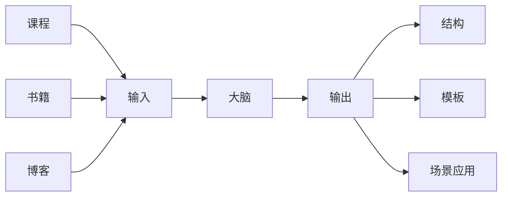

# 请教chatGPT的问题

>https://chatgpt.sbaliyun.com/

## 如何学习数学？
**chatCPT给出的答案**
1. 建立正确的学习态度：要正确认识数学，认为它是一门有趣的学科，而不是一门枯燥乏味的学科。

2. 加强基础：要学好数学，必须先掌握基本的知识点，如数学的基本概念、公式、定理等，这是学习数学的基础。

3. 练习：练习是提高数学水平的重要方法，可以多做一些数学题，通过解题思路和技巧来提高自己的数学水平。

4. 总结：把每一次学习和练习中学到的知识总结起来，把它们融会贯通，这样可以更好地掌握数学知识。

5. 加强记忆：要学习数学，还要做好记忆工作，把学到的知识点牢记在心，这样才能够更好地理解和运用数学知识。

**我的思考**
数学的学习：

# 卡片笔记法