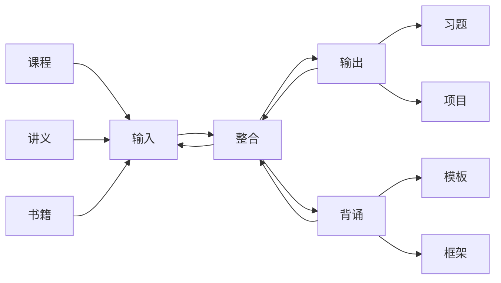
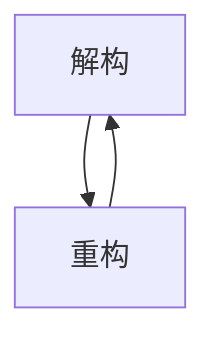

## 系统学习
1. 总体学习流

2. 输入方法
==入门阶段==
对于一门系统的初步习得，通过课程为主导的形式输入是最高效的。
听觉、视觉、参与感、行为模仿等综合因素能够让我快速体会导学科思想，便于指导之后的学习。

==自主阶段==
在一定时间的课程学习之后，整体的学科框架、思想、原理都已经有了一定的认识，可以开始自主学习。
自主学习阶段以书籍和讲义为主导，较难处可以查询资料和查找视频讲解。

==工具使用==
课程一般以视频为主，视频是一种高效的输入方式（，但不是一种高效的整合方式。）
视频软件有很多，一般以在线观看为主，想要下载到本地比较麻烦，而且听过一遍的课程一般不会再听，故而，不需要将视频下载到本地只需要维护一份课程索引即可
视频索引格式：（课程名称，主讲人，主讲人从属，视频地址）
视频地址种类：百度网盘、URL
课程索引可以维护在Chrome的缓冲收藏夹当中

讲义和书籍一般以电子书为主，使用Bookxnote进行存储、查看、标划、注释。

3. 输出方法

做习题（项目），做习题（项目）的过程中可以收集常用的模板。

4. 整合

==整合目标==
- 总体框架
- 难点、疑点
- 模板

==整合流程==
学习是一个认知过程，认知过程是非常复杂的，不是简单的线性。
整合流程是学习过程中最复杂的过程，嵌入在学习流程的每一个环节。
我可以单独划分一段时间用于整合，不过更多的整合还是发生在输入和输出的过程中。

==框架整合==
- 知识点解构：将新学习到的知识按照已经存在的框架进行分解，直到较小单位
- 知识点重构：将已经得到的较小单位重新挂靠到原先的知识框架上
- 框架解重构：当多个框架解构重构得到的新框架变得非常臃肿复杂的时候，需要对于框架进行
	- 精练
	- 黏合
	- 串线
	等等操作，得到一个或多个体量较小的框架，这些框架可以被我直接显示在脑海中。

==框架结构==
总体框架主要以导图的形式呈现：即树形结构。
每个树形结构都有一个认识系统的切入角度。
但是显然从一个角度认识系统是远远不够的，所以需要多个角度下的框架，这些框架往往会随着整合的进程而出现。

==难点、疑点、模板整合==
难点、疑点、模板主要是在输入、输出的过程中形成的概念，需要随时发现随时记录。

难点可以使用流程图的方式来进行说明。
流程可以是“我如何认识？”，也可以是“它如何运作？”。

模板主要使用对照表的形式记录，时常通过对照表的索引来进行内容重现（记忆、背诵）。

==工具使用==
框架导图使用Xmind绘制，完成后的pdf放入Bookxnote.
难点、疑点、模板 使用 Mermaid、或者平板手绘，完成后的pdf放入Bookxnote.

5. 实际学习与工具
认识是一个螺旋上升的过程，而工具刻印的认识记录永远是和当前的认识不完全匹配的，或者这些认识记录之间的结构也是互相统一而矛盾的。

那么面对如此复杂的“历史记录如何处理呢？”，“每次开始学习的时候应该做什么呢？”

- 维护一份学习列表，但是不要在一开始规定时间，而是在开始实际学习之后开始调整学习时间。

- 在学习课程（输入）、完成习题（输出）的时候不要刻意的去整合，如果感到迷失在具体的学科细节的时候，再去浏览一遍框架找回框架感。即听课就认真听、刷题就认真刷、迷失了看框架。

- 在学习的过程中可能会遇到难点、疑点、常用模板，可以先开辟一个空间用于缓冲，等到有完整的时间段的时候再着手整合。

- 大部分时间用于输入和输出，不要划分过多的时间给整合，大约输入：输出：整合 = 1：1：0.5，不同的系统有不同的侧重，可以具体调整。

- 在整合的过程中，尽力即可，不要过度（感到晕眩），在之后的学习中认识永不止步，框架也是如此，不可能有完美的框架。

- 如果感觉到资料、累计的新知识过多，那么显然就需要整理框架进行化简了，不要一直沉迷于框架整合。

- 当资料变得零散、细碎的时候也需要整合，并且归档精练一部分。

- 框架本身某种意义上属于一种需要记忆的模板，是需要和模板放在一起复习的，如果有框架中不清晰的部分，到已经归档的文件中去重新复习就好。

- 时常复习框架、难点疑点文档、复现模板、重读讲义书籍，前三者复习优先级较高

## 考研学习
![[Pasted image 20221002115559.png]]

学习课程、讲义、书籍时按照作者的思路和框架，遇到疑点难点模板记录在Obsidian或者Bookxnote之中。

在合适的时刻（系统学习中讨论）抽出整段时间对于疑点难点进行攻克，然后整理框架、模板，归档已有资料，生成每日复习资料。

## 文档书写
可以按照每次实践的得到的经验和总结书写文档，经过一段时间后进行系统结构规整。
## 学习任务
- 数学——早上
	- 刷一天卷子，补两天漏洞
	- 杨超高数冲刺班、139高数习题库补漏
	- 李正元、李永乐线性代数
	- 李林概统
	- 880习题集
	- 马同学重新梳理体系（学科理论，题型方法，应题模板）
- 专业课——下午
	- 刷一天卷子，补三天漏洞
	- 数据结构王道大题
	- 根据考纲编写自己的必胜宝典

## 已完成任务
- 数学
	- 高等数学
		- 杨超三大计算课程
		- 《三大计算》三刷
		- 杨超基础课
		- 《超详解基础篇》二刷
		- 杨超强化课——提升巨大
		- 《超详解强化篇》二刷
		- 《李林880》基础篇一刷
		- 杨超刷题班高数部分——难度极大，所有题全部背诵
	- 线性代数
		- 《李永乐线代讲义》一刷（除了特征值那章）
		- 李永乐强化课程
		- 周洋鑫强化课程——提升巨大
	- 概率统计
		- 方浩强化课程一半，听不下去
		- 《李正元复习全书》一刷
		- 周洋鑫强化课程——提升巨大
		- 《880讲义》选择性补漏
- 408
	- 王道——选择题全部二刷
	- 01强化课主干线基本掌握